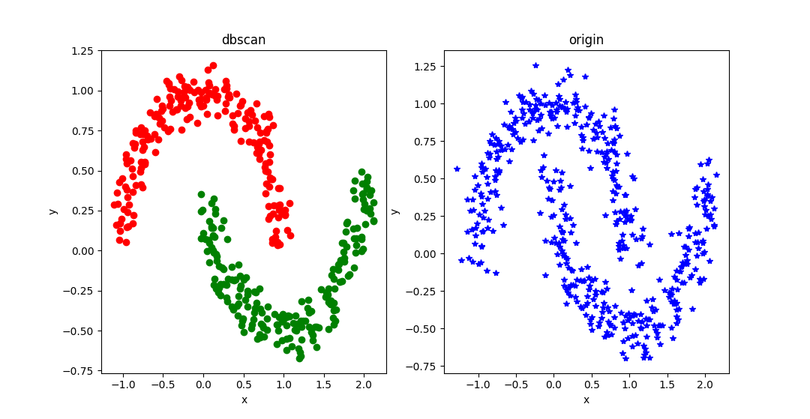

# DBSCAN
Implementation of DBSCAN Algorithm in C++，This implementation can cluster data of any dimension. The distance of data points is Euclidean distance, but you can also modify it to your own distance. In order to speed up the algorithm, I applied the [ANN library](http://www.cs.umd.edu/~mount/ANN/) and used the kd_tree data structure to increase the search speed.
# BUILD
```
cd project_dir
mkdir build
cd build
cmake ..
make -j12
```
then a libary file will genrate in lib directory， The header file is in the include directory。
# OPTIONS
I also wrote a sample, you can open the compilation option BUILD_DBSCAN_SAMPLE through the ccmake command.
After compilation, a dbscan executable file will be generated in the bin directory, run the executable file in the bin directory, the program will read the test data from the dataset directory test_data.pts file, and then cluster and write the results to the dataset The dbscan-res.pts file is in the directory.
```
cd project_dir
mkdir build
cd build
cmake ..
ccmake .
Configure BUILD_DBSCAN_SAMPLE to ON
make -j12
cd ../bin
./dbscan
```
## Visualize the results
```
cd ../python
python vis_result.py
```
The result will be drawn

# EXAMPLE
```
#include <cstdlib>						// C standard library
#include <cstdio>						// C I/O (for sscanf)
#include <cstring>						// string manipulation
#include <fstream>	                    // file I/O
#include <iostream>
#include <vector>
#include "ANN/impl/dbscan.hpp"

int	main(int argc, char **argv)
{
    std::string data_file = "../dataset/test_data.pts";
    std::fstream data_in ;
    data_in.open(data_file, std::ios::in);

    std::vector<std::vector<double>> pts;
    for(int i = 0; i < 500; i++)
    {
        double x, y;
        data_in>>x;
        data_in>>y;
        std::vector<double> pt;
        pt.push_back(x);
        pt.push_back(y);
        pts.push_back(pt);
    }

    dbscan::Dbscan<double> scan = dbscan::Dbscan<double>(2,0.0576,20);
    scan.Run(pts);
    std::vector<std::vector<std::vector<double>>>  res;
    scan.GetCluster(res);
    std::fstream data_out;
    data_out.open("../dataset/dbscan-res.pts", std::ios::out);
    for(std::vector<std::vector<double>> cluter : res)
    {
        data_out<<"@@##@@"<<std::endl;
        for(std::vector<double> pt : cluter)
        {
            data_out<<pt[0]<<" "<<pt[1]<<std::endl;
        }

    }
    data_out.close();
    data_in.close();
   // system("pause");
    return 0;
}
```
# Q&A
If you have any questions, please send me an email at yslrpch@126.com
